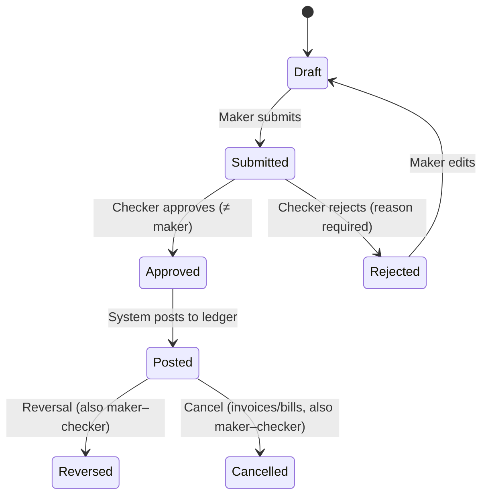

# 06 — Roles, Permissions & Maker–Checker

> **CONFIDENTIAL & PROPRIETARY** — © 2026 Anoup Kumar Thapa. All rights reserved. Do not copy or share without written permission. See [LICENSE](../LICENSE).

## 1. Model
- **Permission** = `module.action` (e.g. `sales_invoice.create`, `sales_invoice.approve`, `report.balance_sheet.view`, `report.export`).
- **Role** = named set of permissions. **Admin** creates/edits roles and assigns users per company (a user can hold different roles in different companies).
- Optional **data scopes** on a role: specific branches, cost centres, projects, bank accounts.
- Optional **amount limits**: e.g. Checker can approve up to NPR 500,000; above that goes to Approver.

## 2. Default roles (editable)
| Role | Typical rights |
|---|---|
| **Super Admin** (platform) | Create companies, platform settings; no day-to-day posting |
| **Company Admin** | Everything in the company: users, roles, tax codes, FY/periods, COA, workflows, Drive connection, all reports |
| **Accountant (Maker)** | Create/edit drafts: invoices, bills, receipts, payments, journals, imports, OCR review; submit for approval; view assigned reports |
| **Senior Accountant (Checker)** | Approve/reject accountant's work; reconcile bank; run depreciation; view & export reports granted |
| **Finance Manager / Approver** | Final approval above limits; lock periods; year-end close (with Admin) |
| **Auditor** | Read-only all books, reports, audit log; export; cannot create anything |
| **Project Manager** | Projects/tasks full; project P&L if granted |
| **Team Member / Staff** | Assigned tasks, upload documents, submit expense claims |
| **Viewer / Owner-view** | Dashboard and selected reports only |

## 3. Report access
- Every report is a permission (`report.<name>.view`, `report.<name>.export`).
- By default only Company Admin has all reports. Admin grants reports to other roles/users explicitly.
- The dashboard hides widgets the user isn't permitted to see.
- Exports are watermarked with user and time; every export is audit-logged.

## 4. Maker–checker workflow

Rules:
1. **Maker cannot approve own document** — enforced in API and DB (`approved_by <> created_by`).
2. Workflows configurable per document type: steps, approver role, amount thresholds, branch.
   Example: Payment < 100k → 1 step (Checker); ≥ 100k → 2 steps (Checker → Finance Manager).
3. Admin can mark low-risk document types as "auto-approve" (e.g. draft quotes) — logged as a setting change.
4. Edits after submission send the document back to Draft.
5. Approval screens show: document, attachments (incl. OCR source), journal preview, history.
6. Bulk approve with per-item confirmation; mobile-friendly approval list.
7. Notifications to checkers on submission; to makers on approval/rejection; daily digest of pending items.
8. Single-user companies: Admin can enable "self-approval" with a warning banner on all reports ("Maker–checker disabled").

## 5. Documents covered
Sales invoices, credit notes, receipts, bills, debit notes, payments, expenses & claims, manual journals, bank transfers, stock adjustments, production orders, depreciation runs, opening balances, reversals, cancellations, period unlock, year reopen, tax code changes, user/role changes (admin-to-admin approval optional).

## 6. Audit trail
- Every action recorded (database.md §4 `audit_logs`), searchable by user, document, date.
- Field-level before/after for master data changes (e.g. bank account number, tax rate).
- Login history and failed login attempts.
- Audit log is read-only for everyone, including Admin.
