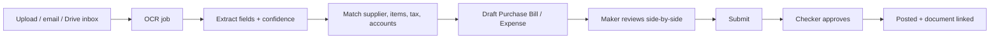

# 07 — Documents, Google Drive & OCR

> **CONFIDENTIAL & PROPRIETARY** — © 2026 Anoup Kumar Thapa. All rights reserved. Do not copy or share without written permission. See [LICENSE](../LICENSE).

## 1. Documents module
- Upload (drag & drop, multi-file, phone camera), preview (PDF/image/Office), version history, tags, search.
- **Link** documents to any record: invoice, bill, journal, contact, project, task, asset.
- **Sharing:** by user, role, or project team; permission levels View / Comment / Edit; optional expiring share links for external parties (e.g. auditor).
- Folders mirror Drive structure (below). Max file size configurable (default 25 MB); virus scanned.

## 2. Google Drive integration
### Connection
- Admin connects a Google account in Settings → Integrations (OAuth 2.0, scopes limited to Drive files created/used by the app, or a chosen Shared Drive).
- **Recommended:** a Google **Shared Drive** owned by the company (files don't disappear if a staff member leaves).
- Members are mapped by email; app-level permissions decide what they see in the app; Drive sharing mirrors project membership.

### Folder structure (auto-created)
```
<Company Name>/
 ├─ FY 2083-84/
 │   ├─ Sales/            invoices, credit notes (PDF copies)
 │   ├─ Purchases/        supplier bills (original uploads + OCR)
 │   ├─ Bank/             statements, reconciliation reports
 │   ├─ Journals/
 │   ├─ Reports/          monthly summary sheets, TB, P&L, BS
 │   └─ Fixed Assets/
 ├─ Projects/<Project>/   documents, weekly progress reports
 └─ Shared/               general documents
```
### Sync behaviour
- Upload in app → stored in object store → background job pushes to Drive; Drive file ID saved.
- Files added directly in a watched Drive folder (e.g. `Purchases/Inbox`) are pulled in and can trigger OCR.
- Scheduled exports: monthly summary sheet and project progress reports saved to Drive automatically (configurable).
- Conflicts: app is the authority for metadata/links; Drive is the authority for file content edits (new version recorded).
- Disconnection never deletes files on either side.

## 3. OCR invoice capture

### Extracted fields
Supplier name, PAN/VAT No./ABN, invoice no., invoice date (BS or AD detected and converted), due date, currency, line items (description, qty, rate, amount), taxable amount, exempt amount, VAT/GST, discounts, total, buyer PAN (check it matches own company).

### Rules
- OCR **never posts directly**; it only creates a Draft (accounting control).
- **Duplicate check:** supplier + invoice no. (+ amount) → warns/blocks.
- **Supplier matching:** by PAN/ABN first, then name similarity; unknown → "create supplier" prompt.
- **Account suggestion:** from supplier default, item mapping, then learned history (last coding for that supplier).
- **Tax check:** recompute VAT from taxable amount × rate; flag mismatch > 1 unit of currency.
- Low-confidence fields highlighted; reviewer must confirm.
- Original image/PDF permanently linked to the bill (audit evidence).
- Email-in address per company (e.g. `bills@…`) for suppliers to send invoices (v2).
- Also usable for receipts/expense claims and bank statement PDFs (v2).

### Providers
Pluggable `OcrProvider` interface: Google Document AI (default), AI-vision model, Tesseract (offline, eng+nep). Admin chooses; costs shown per page.
