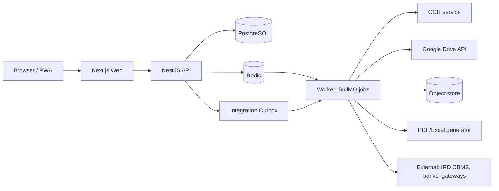

# Architecture

> **CONFIDENTIAL & PROPRIETARY** — © 2026 Anoup Kumar Thapa. All rights reserved. Do not copy or share without written permission. See [LICENSE](../LICENSE).

## 1. Stack and why

| Layer | Choice | Why |
|---|---|---|
| Frontend | **Next.js 15 (React, TypeScript)**, Tailwind CSS, shadcn/ui, TanStack Table, Recharts | Mature, fast, huge ecosystem; good for data-heavy screens |
| Backend API | **NestJS (TypeScript)** | Modular structure fits accounting domains; built-in validation, guards (RBAC), OpenAPI |
| Database | **PostgreSQL 16** | Strong SQL, transactions, constraints, triggers, row-level security, NUMERIC precision |
| ORM | Prisma (CRUD) + hand-written SQL views (reports) | Type-safety plus full SQL power where it matters |
| Queue / jobs | Redis + BullMQ | OCR, Drive sync, statement import, PDF/Excel generation, scheduled tasks |
| File store | Google Drive (shared, master copy) + S3-compatible bucket (cache, previews) | Team access in Drive; fast in-app preview |
| OCR | Google Document AI Invoice Parser; AI-vision fallback; Tesseract (eng+nep) offline option | Accuracy on invoices incl. tax fields |
| PDF / Excel | Playwright HTML→PDF; ExcelJS | Pixel-accurate reports; real `.xlsx` with formulas |
| Auth | Email + password (Argon2), TOTP 2FA, optional Google sign-in | Secure; Google login pairs with Drive |
| Monorepo | pnpm + Turborepo | One repo, shared types and date/money libraries |
| Hosting | Docker Compose on a VPS (start) → managed Postgres + container hosting (scale) | Low cost to start, clear path to grow |
| CI/CD | GitHub Actions: lint, test, build images, deploy | Fully automated from GitHub |

## 2. High-level diagram


## 3. Backend modules (NestJS)
```
auth          users, sessions, 2FA, password reset
tenancy       companies, branches, company switching
settings      fiscal years, periods, number series, tax codes, preferences
coa           chart of accounts, cost centres
contacts      customers, suppliers
items         items, UoM, categories, tax applicability
inventory     warehouses, stock moves, valuation layers, counts
manufacturing BOM, production orders
sales         quotes, orders, invoices, credit notes, receipts
purchases     POs, GRN, bills, debit notes, payments, expenses
banking       bank accounts, transfers, cheques, statements, reconciliation
ledger        journal engine (the ONLY module that writes journal_lines), posting rules, reversals
assets        fixed assets, depreciation
closing       period lock, year-end close, opening balances
approvals     maker–checker workflows
documents     uploads, links, Drive sync
ocr           OCR jobs, extraction, draft creation
projects      projects, tasks, schedules, time logs
reports       financial statements, books, exports
dashboard     KPIs, summary sheet
audit         audit log (append-only)
notifications in-app + email
integrations  outbox, adapters (IRD, bank, gateways), webhooks
```
**Golden rule:** only `ledger` writes to `journal_entries`/`journal_lines`, inside one DB transaction with the source document status change.

## 4. Repository structure
```
ledgerpro/
├─ apps/
│  ├─ web/            Next.js frontend
│  ├─ api/            NestJS API
│  └─ worker/         BullMQ job processors
├─ packages/
│  ├─ db/             Prisma schema, migrations, SQL views, seeds (COA templates, tax codes, BS calendar)
│  ├─ shared/         types, Zod schemas, money & date (BS/AD) utilities, permissions list
│  └─ ui/             shared React components
├─ docs/              these specifications (confidential)
├─ LICENSE            proprietary licence — all rights reserved
├─ infra/             docker-compose.yml, nginx, backup scripts
├─ .github/workflows/ CI/CD
└─ README.md
```

## 5. Multi-tenancy
- Shared database, every business table has `company_id`.
- PostgreSQL **Row-Level Security**: API sets `app.company_id` per request; policies restrict rows. Defence in depth on top of API checks.

## 6. Security
See [security.md](security.md) — full security design.

## 7. Performance
- Ledger indexed on `(company_id, account_id, entry_date)`.
- **Balance snapshots:** `account_period_balances` table updated on post → TB/BS/P&L read snapshots + current-period delta (fast for large data).
- Heavy reports and exports run as background jobs with progress and notification.

## 8. Backup & recovery
- Nightly `pg_dump` + continuous WAL archiving to off-site storage; 30-day retention.
- Monthly restore test (automated job restores to a scratch DB and runs checks: TB balances, row counts).
- Documents safe in Google Drive in addition to object store.

## 9. Deployment (simple path for a non-coder owner)
1. Rent a VPS (e.g. 4 vCPU / 8 GB) or use a managed platform.
2. `docker compose up -d` from `infra/` (one command; CI can do it automatically on each GitHub release).
3. Domain + free TLS (Caddy/Let's Encrypt).
4. Admin first-run wizard in the browser: company, FY, COA template, tax codes, users, Google Drive connection.

## 10. Testing
- Unit tests: posting rules, tax calculation, BS/AD conversion, FIFO/WAC.
- Invariant tests run in CI and nightly in production: every company's trial balance balances; sub-ledgers equal control accounts; no posted entry in a locked period changed.
- End-to-end tests (Playwright) for key flows: invoice → receipt → reconcile → reports.

## 11. Environments
| Environment | Purpose | Data |
|---|---|---|
| `local` | Development on a laptop via Docker Compose | Seed/demo data only |
| `staging` | Every merge to `main` deploys here automatically; UAT | Anonymised copy or demo company |
| `production` | Live use; deploys only from a tagged GitHub release with manual approval | Real data |

Configuration via environment variables (`.env`, never committed). Secrets stored in the host's secret manager or GitHub Actions secrets.

## 12. Request lifecycle
```mermaid
sequenceDiagram
  participant B as Browser
  participant W as Next.js
  participant A as NestJS API
  participant D as PostgreSQL
  B->>W: Action (e.g. Approve invoice)
  W->>A: HTTPS + access token + X-Request-Id
  A->>A: AuthGuard (token) → CompanyGuard (tenant) → PermissionGuard (RBAC) → Validation (Zod/DTO)
  A->>D: BEGIN; SET app.company_id; business logic; ledger post; audit log; outbox event; COMMIT
  D-->>A: OK (or constraint error → rollback)
  A-->>W: 200 JSON / RFC 7807 error
  W-->>B: Updated screen / clear message
```

## 13. Posting flow (the most important path)
1. Approval granted → `ApprovalService` calls `LedgerService.post(document)`.
2. Inside **one DB transaction**: lock document row (`FOR UPDATE`) → verify status `APPROVED` and period open → allocate gapless number → build journal lines from `posting_rules` → insert entry + lines → update `account_period_balances` → update stock layers (if stock) → set document `POSTED` → write audit log + outbox event.
3. Deferred DB trigger verifies debit = credit at commit. Any failure rolls back everything; no partial postings are possible.

## 14. Observability
- Structured JSON logs (pino) with `request_id`, `company_id`, `user_id`; no secrets or full card/bank numbers in logs.
- Error tracking: Sentry (or self-hosted GlitchTip).
- Metrics & uptime: Prometheus/Grafana or a hosted uptime monitor; alerts by email/Slack/Viber.
- Job dashboard (Bull Board, admin-only) for OCR, Drive sync, exports.
- Health endpoints: `/health/live`, `/health/ready` (DB, Redis, Drive token status).

## 15. Scaling path
1. Single VPS (all containers) → 2. Managed PostgreSQL + separate worker container → 3. Multiple API containers behind a load balancer, read replica for reports → 4. Partition `journal_lines` by company/fiscal year if volume demands.

## 16. Related documents
[database.md](database.md) · [security.md](security.md) · [error-handling.md](error-handling.md) · [phases.md](phases.md) · [prompts.md](prompts.md)
