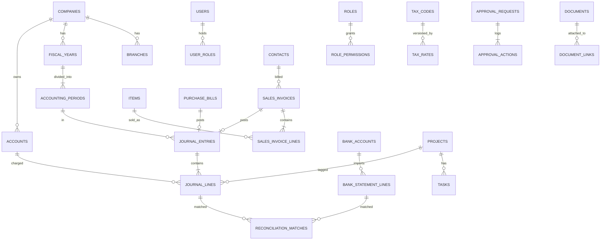

# Database Design (PostgreSQL)

> **CONFIDENTIAL & PROPRIETARY** — © 2026 Anoup Kumar Thapa. All rights reserved. Do not copy or share without written permission. See [LICENSE](../LICENSE).

## 1. Conventions
- Primary keys: `uuid` (v7, time-ordered). Human numbers in separate `doc_no` columns.
- Every business table: `company_id`, `created_at`, `created_by`, `updated_at`, `updated_by`, `version` (optimistic locking).
- Money `NUMERIC(18,2)`, quantity `NUMERIC(18,4)`, rate `NUMERIC(18,6)`.
- Dates `DATE` (AD). Timestamps `timestamptz` (UTC; displayed in company timezone, Asia/Kathmandu or Australia/*).
- Soft delete only for master data (`is_active=false`); never for transactions.
- Status enum for documents: `DRAFT → SUBMITTED → APPROVED → POSTED`, plus `REJECTED`, `CANCELLED`, `REVERSED`.

## 2. Table groups

### Identity & tenancy
`companies`, `branches`, `users`, `user_companies`, `roles`, `permissions`, `role_permissions`, `user_roles`, `sessions`, `user_mfa`

### Settings
`fiscal_years`, `accounting_periods`, `number_series`, `currencies`, `exchange_rates`, `bs_calendar`, `company_settings`

### Master data
`account_groups`, `accounts`, `cost_centres`, `contacts`, `contact_addresses`, `items`, `item_categories`, `uoms`, `uom_conversions`, `warehouses`, `tax_codes`, `tax_rates`, `tds_codes`, `payment_terms`

### Transactions (documents)
`sales_quotes(+_lines)`, `sales_orders(+_lines)`, `delivery_notes(+_lines)`, `sales_invoices(+_lines)`, `credit_notes(+_lines)`, `receipts`, `receipt_allocations`,
`purchase_orders(+_lines)`, `goods_receipts(+_lines)`, `purchase_bills(+_lines)`, `debit_notes(+_lines)`, `payments`, `payment_allocations`, `expenses(+_lines)`,
`bank_transfers`, `cheques`, `manual_journals(+_lines)`, `stock_adjustments(+_lines)`, `stock_transfers(+_lines)`

### Ledger (core)
`journal_entries`, `journal_lines`, `posting_rules`, `account_period_balances`

### Inventory & manufacturing
`stock_moves`, `stock_valuation_layers`, `boms`, `bom_lines`, `production_orders`, `production_consumptions`, `production_outputs`

### Banking & reconciliation
`bank_accounts`, `bank_statement_imports`, `bank_statement_lines`, `reconciliations`, `reconciliation_matches`, `bank_import_templates`

### Fixed assets
`asset_categories`, `fixed_assets`, `depreciation_runs`, `depreciation_lines`, `asset_disposals`

### Controls
`approval_workflows`, `approval_steps`, `approval_requests`, `approval_actions`, `period_locks`, `audit_logs`

### Documents & OCR
`documents`, `document_versions`, `document_links`, `document_shares`, `drive_connections`, `drive_folders`, `ocr_jobs`, `ocr_extractions`

### Projects
`projects`, `project_members`, `milestones`, `tasks`, `task_dependencies`, `task_assignees`, `task_comments`, `time_logs`, `checklists`

### Platform
`notifications`, `integration_outbox`, `integration_logs`, `webhooks`, `api_keys`, `report_access`, `saved_reports`, `export_jobs`

## 3. Core ledger DDL (reference)
```sql
CREATE TABLE accounts (
  id            uuid PRIMARY KEY,
  company_id    uuid NOT NULL REFERENCES companies(id),
  code          varchar(20) NOT NULL,
  name          varchar(150) NOT NULL,
  class         varchar(10) NOT NULL CHECK (class IN ('ASSET','LIABILITY','EQUITY','INCOME','EXPENSE')),
  group_id      uuid REFERENCES account_groups(id),
  parent_id     uuid REFERENCES accounts(id),
  is_postable   boolean NOT NULL DEFAULT true,   -- false for group/heading accounts
  is_control    boolean NOT NULL DEFAULT false,  -- AR, AP, Inventory, VAT
  is_system     boolean NOT NULL DEFAULT false,
  currency_code char(3),
  is_active     boolean NOT NULL DEFAULT true,
  UNIQUE (company_id, code)
);

CREATE TABLE journal_entries (
  id            uuid PRIMARY KEY,
  company_id    uuid NOT NULL REFERENCES companies(id),
  branch_id     uuid REFERENCES branches(id),
  entry_no      varchar(40) NOT NULL,
  entry_date    date NOT NULL,
  period_id     uuid NOT NULL REFERENCES accounting_periods(id),
  source_type   varchar(40) NOT NULL,    -- SALES_INVOICE, BILL, RECEIPT, MANUAL, OPENING, CLOSING, REVERSAL...
  source_id     uuid,
  narration     text,
  status        varchar(12) NOT NULL DEFAULT 'POSTED' CHECK (status IN ('POSTED','REVERSED')),
  reversal_of   uuid REFERENCES journal_entries(id),
  posted_by     uuid NOT NULL REFERENCES users(id),
  approved_by   uuid REFERENCES users(id),
  posted_at     timestamptz NOT NULL DEFAULT now(),
  UNIQUE (company_id, entry_no)
);

CREATE TABLE journal_lines (
  id             uuid PRIMARY KEY,
  entry_id       uuid NOT NULL REFERENCES journal_entries(id),
  company_id     uuid NOT NULL,
  line_no        int NOT NULL,
  account_id     uuid NOT NULL REFERENCES accounts(id),
  debit          numeric(18,2) NOT NULL DEFAULT 0 CHECK (debit  >= 0),
  credit         numeric(18,2) NOT NULL DEFAULT 0 CHECK (credit >= 0),
  CHECK ((debit = 0) <> (credit = 0)),         -- exactly one side
  currency_code  char(3) NOT NULL,
  fx_rate        numeric(18,6) NOT NULL DEFAULT 1,
  amount_fc      numeric(18,2),                -- foreign currency amount
  contact_id     uuid REFERENCES contacts(id),
  item_id        uuid REFERENCES items(id),
  cost_centre_id uuid REFERENCES cost_centres(id),
  project_id     uuid REFERENCES projects(id),
  tax_code_id    uuid REFERENCES tax_codes(id),
  description    text
);
CREATE INDEX ix_jl_acct_date ON journal_lines (company_id, account_id);

-- Balanced-entry guarantee, checked at COMMIT
CREATE FUNCTION check_entry_balanced() RETURNS trigger AS $$
BEGIN
  IF (SELECT COALESCE(SUM(debit),0) - COALESCE(SUM(credit),0)
        FROM journal_lines WHERE entry_id = NEW.entry_id) <> 0 THEN
    RAISE EXCEPTION 'Journal entry % is not balanced', NEW.entry_id;
  END IF;
  RETURN NULL;
END $$ LANGUAGE plpgsql;

CREATE CONSTRAINT TRIGGER trg_entry_balanced
  AFTER INSERT OR UPDATE ON journal_lines
  DEFERRABLE INITIALLY DEFERRED FOR EACH ROW EXECUTE FUNCTION check_entry_balanced();

-- Immutability: block UPDATE/DELETE on posted ledger rows
CREATE FUNCTION block_ledger_change() RETURNS trigger AS $$
BEGIN RAISE EXCEPTION 'Posted ledger rows are immutable; use a reversal'; END $$ LANGUAGE plpgsql;
CREATE TRIGGER trg_jl_immutable BEFORE UPDATE OR DELETE ON journal_lines
  FOR EACH ROW EXECUTE FUNCTION block_ledger_change();
-- (journal_entries allows only status POSTED→REVERSED via a controlled function)

-- Period lock guarantee
CREATE FUNCTION check_period_open() RETURNS trigger AS $$
BEGIN
  IF EXISTS (SELECT 1 FROM accounting_periods WHERE id = NEW.period_id AND is_locked) THEN
    RAISE EXCEPTION 'Period is locked';
  END IF;
  RETURN NEW;
END $$ LANGUAGE plpgsql;
CREATE TRIGGER trg_je_period BEFORE INSERT ON journal_entries
  FOR EACH ROW EXECUTE FUNCTION check_period_open();
```

## 4. Other key tables (fields)
- **fiscal_years:** id, company_id, label (`2083/84`), start_date, end_date, status (`OPEN`,`CLOSED`), closed_by, closed_at
- **accounting_periods:** id, fiscal_year_id, period_no (1–13), name (`Shrawan 2083`), start_date, end_date, is_locked, is_adjustment
- **tax_codes:** id, company_id, code, name, type, output_account_id, input_account_id, is_claimable, is_active
- **tax_rates:** id, tax_code_id, rate, effective_from, effective_to
- **items:** id, company_id, sku, name, type, uom_id, default_tax_code_id, tax_applicability (`TAXABLE`,`ZERO_RATED`,`EXEMPT`,`OUT_OF_SCOPE`), sales_account_id, purchase_account_id, inventory_account_id, cogs_account_id, is_stock_tracked, reorder_level
- **number_series:** id, company_id, doc_type, fiscal_year_id, prefix, next_no, padding — incremented with `SELECT … FOR UPDATE` to stay gapless
- **bank_statement_lines:** id, import_id, bank_account_id, txn_date, value_date, description, reference, cheque_no, debit, credit, balance, status (`UNMATCHED`,`MATCHED`,`CREATED`,`UNIDENTIFIED`,`IGNORED`)
- **reconciliation_matches:** id, reconciliation_id, statement_line_id, journal_line_id, matched_amount, matched_by, method (`AUTO`,`MANUAL`)
- **approval_requests:** id, company_id, doc_type, doc_id, workflow_id, current_step, status, submitted_by, submitted_at
- **audit_logs:** id (bigserial), company_id, user_id, action, entity, entity_id, before jsonb, after jsonb, ip, user_agent, at, prev_hash, hash
- **documents:** id, company_id, name, mime, size, sha256, storage_key, drive_file_id, folder_id, uploaded_by, visibility, tags
- **integration_outbox:** id, company_id, target, event_type, payload jsonb, status, attempts, next_attempt_at, last_error

## 5. Reporting views
- `v_gl_lines` — journal lines joined with entry, account, contact, project, BS date.
- `v_trial_balance(company, from, to)` — opening, period Dr/Cr, closing per account (SQL function).
- `v_ar_aging`, `v_ap_aging`, `v_stock_on_hand`, `v_vat_register`.

## 6. Data integrity jobs (nightly)
- Sum of all journal lines per company = 0.
- AR control balance = sum of open customer balances; same for AP, Inventory = stock valuation.
- Bank book balance − reconciled items = statement balance per last reconciliation.
- Audit log hash chain verified.
Any failure alerts Admin.

## 7. Entity relationship overview


## 8. Additional reference DDL
```sql
-- Document header pattern (same shape for bills, credit notes, debit notes)
CREATE TABLE sales_invoices (
  id              uuid PRIMARY KEY,
  company_id      uuid NOT NULL REFERENCES companies(id),
  branch_id       uuid REFERENCES branches(id),
  doc_no          varchar(40),                       -- assigned on POST (gapless)
  invoice_date    date NOT NULL,
  due_date        date,
  contact_id      uuid NOT NULL REFERENCES contacts(id),
  buyer_pan       varchar(20),
  currency_code   char(3) NOT NULL,
  fx_rate         numeric(18,6) NOT NULL DEFAULT 1,
  price_includes_tax boolean NOT NULL DEFAULT false,
  subtotal        numeric(18,2) NOT NULL DEFAULT 0,
  discount_total  numeric(18,2) NOT NULL DEFAULT 0,
  taxable_total   numeric(18,2) NOT NULL DEFAULT 0,
  exempt_total    numeric(18,2) NOT NULL DEFAULT 0,
  tax_total       numeric(18,2) NOT NULL DEFAULT 0,
  grand_total     numeric(18,2) NOT NULL DEFAULT 0,
  amount_due      numeric(18,2) NOT NULL DEFAULT 0,
  status          varchar(12) NOT NULL DEFAULT 'DRAFT'
                  CHECK (status IN ('DRAFT','SUBMITTED','APPROVED','REJECTED','POSTED','CANCELLED','REVERSED')),
  cancel_reason   text,
  print_count     int NOT NULL DEFAULT 0,
  project_id      uuid REFERENCES projects(id),
  journal_entry_id uuid REFERENCES journal_entries(id),
  created_by      uuid NOT NULL REFERENCES users(id),
  approved_by     uuid REFERENCES users(id),
  CHECK (approved_by IS NULL OR approved_by <> created_by),   -- maker ≠ checker
  CHECK (status <> 'CANCELLED' OR cancel_reason IS NOT NULL),
  UNIQUE (company_id, doc_no)
);

CREATE TABLE purchase_bills (
  -- same pattern as sales_invoices, plus:
  supplier_invoice_no varchar(60) NOT NULL,
  supplier_pan        varchar(20),
  source_document_id  uuid REFERENCES documents(id),  -- OCR original
  ocr_job_id          uuid REFERENCES ocr_jobs(id)
  -- UNIQUE (company_id, contact_id, supplier_invoice_no) → duplicate guard
);

CREATE TABLE tax_codes (
  id               uuid PRIMARY KEY,
  company_id       uuid NOT NULL REFERENCES companies(id),
  code             varchar(20) NOT NULL,
  name             varchar(80) NOT NULL,
  type             varchar(20) NOT NULL CHECK (type IN ('STANDARD','ZERO_RATED','EXEMPT','OUT_OF_SCOPE','REVERSE_CHARGE')),
  output_account_id uuid REFERENCES accounts(id),
  input_account_id  uuid REFERENCES accounts(id),
  is_claimable     boolean NOT NULL DEFAULT true,
  is_active        boolean NOT NULL DEFAULT true,
  UNIQUE (company_id, code)
);
CREATE TABLE tax_rates (
  id             uuid PRIMARY KEY,
  tax_code_id    uuid NOT NULL REFERENCES tax_codes(id),
  rate           numeric(7,4) NOT NULL CHECK (rate >= 0 AND rate <= 100),
  effective_from date NOT NULL,
  effective_to   date,
  EXCLUDE USING gist (tax_code_id WITH =, daterange(effective_from, effective_to, '[]') WITH &&)  -- no overlapping rates
);

CREATE TABLE approval_requests (
  id           uuid PRIMARY KEY,
  company_id   uuid NOT NULL,
  doc_type     varchar(40) NOT NULL,
  doc_id       uuid NOT NULL,
  workflow_id  uuid NOT NULL REFERENCES approval_workflows(id),
  current_step int NOT NULL DEFAULT 1,
  status       varchar(12) NOT NULL CHECK (status IN ('PENDING','APPROVED','REJECTED','WITHDRAWN')),
  submitted_by uuid NOT NULL REFERENCES users(id),
  submitted_at timestamptz NOT NULL DEFAULT now()
);
CREATE TABLE approval_actions (
  id          uuid PRIMARY KEY,
  request_id  uuid NOT NULL REFERENCES approval_requests(id),
  step_no     int NOT NULL,
  action      varchar(10) NOT NULL CHECK (action IN ('APPROVE','REJECT','RETURN')),
  acted_by    uuid NOT NULL REFERENCES users(id),
  comment     text,
  acted_at    timestamptz NOT NULL DEFAULT now()
);

CREATE TABLE audit_logs (
  id          bigserial PRIMARY KEY,
  company_id  uuid,
  user_id     uuid,
  action      varchar(40) NOT NULL,
  entity      varchar(60) NOT NULL,
  entity_id   uuid,
  before      jsonb,
  after       jsonb,
  ip          inet,
  user_agent  text,
  request_id  varchar(64),
  at          timestamptz NOT NULL DEFAULT now(),
  prev_hash   char(64),
  hash        char(64) NOT NULL
);
-- App DB role has INSERT + SELECT only on audit_logs (no UPDATE/DELETE grants).

CREATE TABLE account_period_balances (
  company_id  uuid NOT NULL,
  account_id  uuid NOT NULL REFERENCES accounts(id),
  period_id   uuid NOT NULL REFERENCES accounting_periods(id),
  branch_id   uuid,
  debit_total  numeric(18,2) NOT NULL DEFAULT 0,
  credit_total numeric(18,2) NOT NULL DEFAULT 0,
  PRIMARY KEY (company_id, account_id, period_id, branch_id)
);
```

## 9. Row-level security (tenant isolation)
```sql
ALTER TABLE journal_lines ENABLE ROW LEVEL SECURITY;
CREATE POLICY tenant_isolation ON journal_lines
  USING (company_id = current_setting('app.company_id')::uuid);
-- Same policy applied to every table with company_id.
```

## 10. Database roles
| DB role | Rights | Used by |
|---|---|---|
| `ledger_owner` | Owns schema, runs migrations | CI migration step only |
| `ledger_app` | CRUD on business tables, INSERT/SELECT on audit & ledger (no UPDATE/DELETE on journal_lines) | API & worker |
| `ledger_readonly` | SELECT only | Reporting, BI tools, auditors' exports |

## 11. Migrations policy
- Forward-only SQL migrations in `packages/db/migrations` (run by `pnpm db:migrate`, checksum-protected: an applied migration can never be edited); every change via a reviewed migration file in Git; never manual changes in production.
- Migrations are forward-only and backward-compatible (expand → migrate data → contract) to allow zero-downtime deploys.
- Automatic backup immediately before each production migration.

## 12. Key indexes
- `journal_lines (company_id, account_id)`, `(company_id, contact_id)`, `(company_id, project_id)`
- `journal_entries (company_id, entry_date)`, `(source_type, source_id)`
- `sales_invoices (company_id, status, invoice_date)`, `(company_id, contact_id)`
- `bank_statement_lines (bank_account_id, status, txn_date)`
- `audit_logs (company_id, entity, entity_id)`, `(company_id, at)`
- Trigram index on contact/item names for fast search.

## 13. Seed data
COA templates (Service, Trading, Manufacturing, Mixed × Nepal/IFRS), tax codes (Nepal VAT, Australia GST), BS calendar table (2000–2100 BS), default roles & permissions, currencies, UoMs, posting rules.
